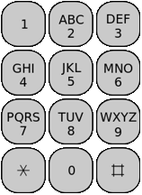

# Broken Keypad

**Premise:**

Given a keypad, where number 2 stands for letter a or b or c, and number 3 stands for d or e or f , etc, 
as defined on keypad of a old cell phone, and given a standard dictionary, that only allows you to check 
if a string of letters comprise a valid word or not, output all possible valid words, 
according to the dictionary, represented by the input sequence of a set of digits.

For example, "228" would output "cat, bat, act."

## How to Run

**Command Line:**
1) Navigate to the folder containing the `.csproj` file (`cd ./BrokenKeypad`)
2) Run the following command with your desired configuration: `dotnet run [--filepath <path to dictionary file>] [--mode <search mode>] [--dictionary-type <type>] [--print-dictionary]`
    * all args are optional
    * `--filepath`: path to `.txt` file containing the dictionary to use to verify word validity
        * default is `../dictionary.txt`
    * `--mode`: the mode used to lookup words
        * options include: `exhaustive-search`, `branch-and-bound`
        * default is `branch-and-bound`
    * `--dictionary-type`: the data structure used to store the dictionary
        * options include: `hash`, `prefix-tree`
        * default is `prefix-tree`
    * `--print-dictionary`: if included, all the words in the dictionary being used will be printed to the console

**Visual Studio:**
1) Navigate to the folder containing the `.slnx` file
2) Open the file in Visual Studio
3) Locate the play button
    * If you wish to run with the default settings, you do not need to do anything else
    * If you wish to change the settings:
        1) Click the dropdown next to the play button and click the menu item that says "BrokenKeypad Debug Properties"
        2) Enter arguments in the section labeled "Command line arguments"
        3) Click the `Browse...` button and choose the directory with the `.csproj` file in it
            * This is especially important if you are using the default `dictionary.txt` file
            * Without it, the file will not be able to be found
        4) Exit out of the Launch Profiles popup. It should save automatically.
4) Click the play button
